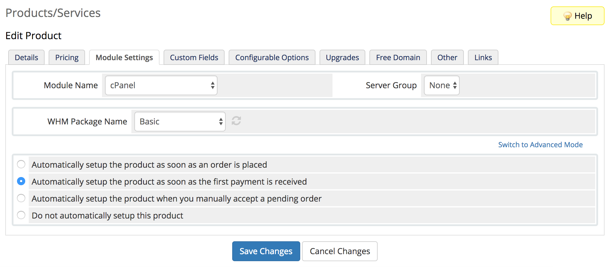
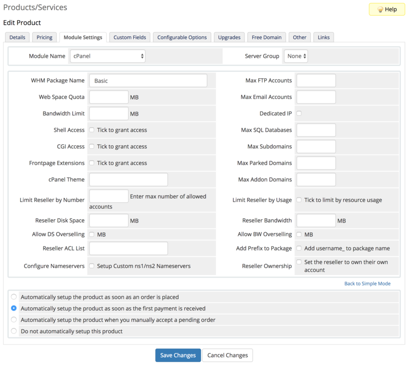

+++
prev = "/provisioning-modules/config-options"
next = "/provisioning-modules/loader-functions"
title = "Simple Mode"
toc = true
weight = 18

+++

Simple Configuration Mode is a feature available to module developers to simplify the configuration process for a module.

Using Simple Mode allows you to reduce the number of Module Setting fields that are shown to end users by default.  For example, you can restrict the default Module Settings view to just the most common fields that a user needs to customise when creating a product assigned to your module, and have the other less commonly used fields only be shown if the user switches to Advanced Mode.

The screenshots below shows the difference in Simple and Advanced Modes for the cPanel module.

## Simple Mode



## Advanced Mode



To enable Simple Mode for your module, all you need to do is set an additional parameter in your Module Setting field definitions that you wish to appear in Simple Mode.  Below is an example of a module with two fields, one in Simple Mode, and the other only shown when in Advanced Mode:

```
function provisioningmodule_ConfigOptions($params)
{
    return [
        'Simple Mode Field' => [
            'Type' => 'text',
            'Size' => '25',
            'SimpleMode' => true,
        ],
        'Advanced Mode Field' => [
            'Type' => 'text',
            'Size' => '25',
        ],
    ];
}
```
